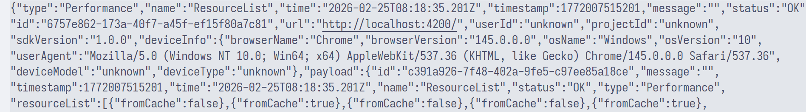

# lark-sentry

- Vue3
- React
- ...

## Rollup

```bash
pnpm add rollup -D

pnpm add \
@rollup/plugin-commonjs \
@rollup/plugin-json \
@rollup/plugin-node-resolve \
@rollup/plugin-terser \
@rollup/plugin-typescript \
rollup-plugin-dts -D
```

## Client

pnpm-workspace.yaml

```yaml
packages:
  - "sentry"
  - "client"
  - "server"
```

Install dependencies

```bash
pnpm add lark-sentry --filter client
```

Update ./client/vite.config.ts

```ts
import { defineConfig } from "vite";

export default defineConfig({
  optimizeDeps: {
    // 禁止预构建依赖
    exclude: ["lark-sentry"],
  },
});
```

Update ./client/src/main.ts[x]

```ts
import { init, larkEnable } from "lark-sentry";
import PerformancePlugin from "lark-sentry/plugins/perf";
import ScreenRecordPlugin from "lark-sentry/plugins/record";
import ExposurePlugin from "lark-sentry/plugins/exposure";

init({ dsn: "/api/log" });
larkEnable(PerformancePlugin);
larkEnable(ScreenRecordPlugin);
larkEnable(ExposurePlugin);
```

## Server

```bash
cd ./server
pnpm dev
```

## Logs



## package.json

```json
{
  "type": "module",
  // main: cjs 入口
  "main": "./dist/index.cjs",
  // module: esm 入口
  "module": "./dist/index.js",
  // types: ts 类型声明入口
  "types": "./dist/index.d.ts",
  "exports": {
    ".": {
      // exports.types: ts 类型声明入口
      "types": "./dist/index.d.ts",
      // exports.import: esm 入口, 优先级高于 module
      "import": "./dist/index.js",
      // exports.require: cjs 入口, 优先级高于 main
      "require": "./dist/index.cjs"
    }
  },
  // files: 发布到 npm 时包含的文件/目录
  "files": ["dist"],
  "publishConfig": {
    "access": "public"
  }
}
```

## publish

```bash
npm config get registry
npm config set registry https://registry.npmjs.org/

npm login --registry=https://registry.npmjs.org
npm publish --registry=https://registry.npmjs.org --access public
```
